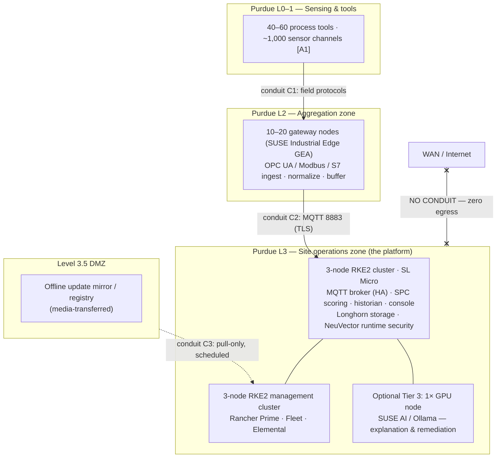

# Reference Architecture RA-01 — Predictive Maintenance at 1,000 Sensor Channels, 100% On-Premises

**Audience:** VP of IT/OT and the architecture review board · **Status:** For approval
**Companion document:** [RA-02 — Hybrid with AWS-hosted services](RA-02-hybrid-aws.md) (identical section numbering for side-by-side comparison)
**Version basis:** SUSE Edge 3.6.1 release matrix, verified against documentation.suse.com on 2026-07-23 · **Re-verify by:** 2026-10-23

---

## 1. Executive summary

**Decision requested:** approve a two-phase deployment of an on-premises
predictive-maintenance platform for the site's ~1,000 sensor channels —
Phase 1 pilot on one production line (8 weeks, exit criteria in §13), Phase
2 site rollout contingent on pilot exit — with budget per the cost model in
§12 and the staffing plan in §10.6.

**Situation.** The site's process tools generate continuous sensor telemetry
that today is used reactively: excursions are found after scrap or downtime,
and condition data leaves value on the table. Unplanned downtime is the
single largest recoverable manufacturing loss — across industry, Siemens'
*True Cost of Downtime 2024* estimates it at ~$1.4T annually for the world's
500 largest companies (~11% of revenues), and in ITIC's 2024 survey more
than 90% of mid-size and large enterprises put one hour of downtime above
$300,000. This site's own figure is an input this document requests (§12).

**Complication.** The telemetry that enables prediction is also among the
site's most sensitive intellectual property: process traces and recipes
reveal how we make what we make. Any solution that ships raw telemetry
off-site is a non-starter — which rules out the default cloud-analytics
pattern, and is why this architecture is designed *from* the sovereignty
constraint rather than patching it on.

**Answer.** Deploy scoring at the edge: a hardened, highly available
Kubernetes platform on the plant floor runs statistical process control
(Hotelling T²/EWMA) models against every channel in real time, forecasts
remaining useful life, attributes excursions to specific sensors, and keeps
**every byte of raw telemetry inside the site boundary — zero WAN egress in
this variant**. The platform is built from a certified, co-versioned
open-source stack (SUSE Edge 3.6.1: SUSE Linux Micro, RKE2/K3s, Rancher
Prime, Longhorn, NeuVector; SUSE Industrial Edge gateways; on-premises
platform install) with a documented exit path at every layer (§14). The
detection pattern is not speculative: a runnable reference kit implements
this exact pipeline end to end and is verified in CI, including a
golden-parity test of the scoring model and a live egress-block exercise
(§15.1 — with explicit scope statements about what those proofs do and do
not cover).

**Business case (sourced, to be localized with site actuals).** McKinsey's
operations practice reports predictive maintenance typically reduces
machine downtime 30–50% and increases machine life 20–40%; Deloitte's
position paper reports on average +25% productivity, −70% breakdowns, −25%
maintenance cost. Applied to this site's downtime cost ($/hour — required
input, §12), even the conservative end funds the platform severalfold. No
site-specific ROI is asserted in this document; §12 provides the formula
and a clearly-labeled illustrative example.

**Why this design makes sense** (and would with different logos): one
declarative platform for all plant-floor workloads instead of per-tool
appliances; immutable transactional OS with rollback for change-safe
maintenance windows; zero-trust runtime security with an auditable egress
contract; fleet-consistent operations that scale from this site to others;
long support horizons (base OS general support to 2029-11-30) with
single-vendor accountability across the stack.

---

## 2. Scope, assumptions, and claim labeling

### 2.1 Claim labeling used throughout

| Label | Meaning |
|---|---|
| **[Lab-verified]** | Demonstrated in the reference kit in this repository; scope stated at each citation (§15.1) |
| **[Sourced]** | Vendor documentation or named study; version and verification date pinned |
| **[Assumption A#]** | Design assumption, numbered in §2.2; every derived figure cites its assumption |
| **[FILL]** | Site-specific input this document requests before final costing |

### 2.2 Assumption log

| # | Assumption | Sensitivity |
|---|---|---|
| **A1** | "1,000 sensor endpoints" = 1,000 discrete sensor **channels** across ~40–60 process tools, scalar telemetry at 1 Hz plus windowed derived features. High-rate waveform channels (e.g., kHz vibration) are out of scope for the base design; if present, feature extraction moves adjacent to the tool and the ingest tier is re-sized. | **Critical** — every throughput and sizing number derives from this |
| **A2** | Message shape ≈ 200 bytes/sample ⇒ ~1,000 msg/s site-wide, ~86.4M msgs/day, ~0.2 MB/s sustained ingest. | Medium |
| **A3** | Alarm/query rate for the optional AI-explanation tier ≤ 50 interactions/hour site-wide (it scales with excursions and engineer queries, **not** with sensor count). | Medium (affects only optional Tier 3) |
| **A4** | Site unplanned-downtime cost **[FILL: $/hour from finance]**. Industry reference points in §12 only. | Critical to ROI, not to architecture |
| **A5** | Brownfield site: existing SCADA/historian/FDC systems remain; this platform ingests via OPC UA/Modbus alongside them (§4.4). | High |
| **A6** | One site, fleet-ready: management plane sized for multi-site expansion, but all sizing and cost in this document are single-site. | Medium |

### 2.3 In scope / out of scope

**In scope:** sensor aggregation, edge scoring, alerting/visualization,
optional on-prem AI explanation, platform security, HA, Day-2 operations.
**Out of scope:** closed-loop control (this platform advises maintenance; it
does not command tools), MES/ERP integration beyond alert export, replacing
incumbent FDC/SCADA (§4.4).

---

## 3. Requirements

### 3.1 Functional (condensed)

Continuous per-channel scoring with per-tool learned baselines; excursion
detection with sensor attribution; remaining-useful-life forecasting;
operator console with alarm management; fault-injection test harness for
commissioning; on-prem AI-generated remediation guidance (optional tier).

### 3.2 Non-functional requirements

| NFR | Target | Verification method |
|---|---|---|
| Data sovereignty | **Zero WAN egress from the OT zone.** Raw telemetry, derived scores, and configuration never leave the site | Firewall ruleset review + §7 defense-in-depth + quarterly egress audit (§10.3); mechanism demonstrated by the kit's `sovereignty-verify` [Lab-verified, single-namespace scope] |
| Availability behavior | No single point of failure in ingest, scoring, or storage; behavior under each failure mode per §8 table (no unsourced "nines" are claimed) | Failure-mode drills at pilot exit (§13) |
| Recovery targets | Node loss: automatic, ≤ 5 min service restoration target. Quorum loss: ≤ 4 h restore-from-snapshot target. Site power loss: cold-start runbook ≤ 1 h target | Timed drills, §13 |
| Data retention | 90 days full-resolution on-site [Assumption A2 sizing]; 3 years derived health history | Storage audit |
| Scoring latency | Sensor sample → scored verdict ≤ 5 s end-to-end | Pilot measurement |
| Security | IEC 62443-3-3 **SL 2 target (SL-T)** for the monitoring zone; zones/conduits per §7 | Control-mapping table §7.5 + third-party assessment [FILL: schedule] |
| Patching | Monthly OS/platform patch window with A/B rollback; emergency CVE path ≤ 72 h | §10.1 process; drill at pilot |

---

## 4. Architecture overview

### 4.1 Zone model (Purdue / IEC 62443)



### 4.2 Tiers

| Tier | Function | Components (product in parentheses) |
|---|---|---|
| Sensing | Existing tool sensors and PLCs | Site equipment (unchanged) |
| Aggregation | Protocol ingest, normalization, offline buffering, the **single governed egress point** design pattern | Gateway Edge Agents (SUSE Industrial Edge / Losant GEA — 512 MB/8 GB min per agent, 65,000-message offline buffer [Sourced: docs.losant.com]) |
| Platform | HA Kubernetes, storage, runtime security | 3-node RKE2 1.35.4 on SL Micro 6.2; Longhorn 1.11.2 (3-replica, dedicated SSD + storage network); NeuVector 5.5.2 (3 controllers, enforcer per node) [Sourced: SUSE Edge 3.6.1] |
| Scoring | Per-channel SPC (T²/EWMA), RUL, attribution | Containerized scoring service — the reference kit's model [Lab-verified: golden parity; fidelity, not throughput] |
| Data & console | HA MQTT, time-series historian, operator console, alarm management | Clustered MQTT broker (see §5 alternatives), on-prem historian, on-prem platform console (Losant **on-premises install** — vendor documents on-prem/private-cloud deployment [Sourced]) |
| Management | Provisioning, GitOps, lifecycle | Rancher Prime 2.14.2 + Fleet on a separate 3-node RKE2 management cluster; Edge Image Builder 1.3.3.1 + Elemental 1.9.0 [Sourced] |
| Optional Tier 3 | On-prem AI explanation/remediation | 1× GPU node (SUSE AI floor: 8–16 cores / 64 GB / 100 GB SSD + NVIDIA GPU [Sourced]); sized by alarm rate [A3], **not** sensor count. The SPC tier operates fully without it |

### 4.3 Design properties worth approving

- **Agents dial out, nothing dials in:** downstream clusters initiate all
  connections to the management plane [Sourced: Rancher docs]; combined with
  the zero-egress rule this means no inbound firewall holes to the OT zone.
- **Declarative recovery:** every workload and cluster is Git-defined; a
  destroyed node is re-imaged (Elemental) and converges automatically.
- **Immutable OS with rollback:** SL Micro A/B transactional updates make
  patch windows reversible by design.

### 4.4 Brownfield coexistence (mandatory posture)

This platform **augments** the incumbent FDC/SCADA/historian estate; it does
not replace it. Ingest is read-only from existing OPC UA servers/historians
where available, direct from PLC protocols where not. Alerts export to the
existing CMMS/alarm workflow. Rip-and-replace is explicitly rejected
(§14.1). [Assumption A5]

---

## 5. Component catalog, alternatives, and exit paths

| Function | Selected | Rationale (function first) | Primary alternative | Exit path |
|---|---|---|---|---|
| Edge OS | Immutable transactional Linux (SL Micro 6.2) | A/B rollback, SELinux enforcing, general support to **2029-11-30** [Sourced: suse.com/lifecycle] | Flatcar / RHEL for Edge | Standard OCI workloads move unchanged |
| Kubernetes | RKE2 1.35.4 (etcd, CIS/FIPS-capable) | Hardened profile + 3-node quorum; K3s reserved for the pilot footprint | Vanilla k8s / OpenShift | CNCF-conformant — manifests portable |
| GitOps/mgmt | Rancher Prime + Fleet | Fleet-consistent config; dial-out agents | Argo CD + upstream Rancher | Continue on OSS unsupported, or Argo |
| Storage | Longhorn 1.11.2, 3-replica | Replicated block on commodity SSD; snapshot/backup native | Rook/Ceph | CSI standard; PV migration |
| Runtime security | NeuVector 5.5.2 | L7 zero-trust, Protect mode, admission control; one layer of §7's stack | Cilium+Falco assembly | Policies re-expressible; OSS NeuVector exists |
| MQTT | **Design choice at detail phase:** clustered broker (EMQX/HiveMQ) for single logical HA endpoint, or per-cell Mosquitto with gateway failover — Mosquitto itself does not cluster [Sourced] | 1,000 msg/s is trivial for either [A2]; the choice is an HA-topology decision, not throughput | — | MQTT 3.1.1/5 standard protocol |
| Gateways | SUSE Industrial Edge GEA | OPC UA/Modbus/S7/EtherNet-IP ingest, offline buffer, workflow engine [Sourced] | Telegraf/Node-RED assembly | MQTT contract preserved |
| Platform console | Losant on-premises install | Vendor-documented on-prem deployment option [Sourced]; single pane for device/dashboard/workflow | Grafana + custom | Historian data is open time-series |
| Scoring | Reference-kit SPC service | Open Python/stdlib model, golden-parity CI [Lab-verified] | Commercial FDC add-on | The model is ours; no lock-in |

---

## 6. Data governance & sovereignty

### 6.1 Data classification

| Class | Examples | Residency |
|---|---|---|
| **C1 — Trade secret** | Raw sensor traces, recipes, tool parameters, lot↔tool mapping | **Never leaves the OT zone.** Not the DMZ, not IT, not anywhere |
| C2 — Operationally sensitive | Derived health scores, RUL, attribution, alarm history | Site operations zone; visible to site engineering |
| C3 — Administrative | Platform configs (secrets externalized), software inventories, logs w/o payloads | Site; DMZ mirror for update metadata only |

### 6.2 Egress matrix (the auditable artifact)

| Flow | Content | Direction | Allowed? |
|---|---|---|---|
| Tools → Gateways | C1 raw | L0/1 → L2 | Yes (conduit C1) |
| Gateways → Platform | C1 raw (normalized) | L2 → L3 | Yes (conduit C2, TLS) |
| Platform → anywhere beyond L3 | any | L3 → DMZ/IT/WAN | **No. Zero egress.** |
| DMZ mirror → Management | Update artifacts (signed, media-loaded) | DMZ → L3 | Pull-only, scheduled (conduit C3) |

Updates enter by removable media or a one-way staged mirror; nothing exits.
The gateway tier's governed-egress design (only derived fields *could* ever
be published) remains in force as defense-in-depth even though this variant
permits no egress at all — the mechanism is demonstrated by the kit
[Lab-verified: air-gapped counter behavior; single-node scope].

---

## 7. Security architecture

### 7.1 Defense-in-depth stack (no single product carries the claim)

1. **Physical/VLAN segmentation** — OT zones per Purdue; managed switches, port security.
2. **Site firewall** — default-deny both directions at every conduit; the L3→WAN conduit **does not exist**.
3. **Kubernetes NetworkPolicy** — default-deny egress in workload namespaces [Lab-verified mechanism: `make sovereignty-verify`, blocked egress with positive control].
4. **Runtime L7 enforcement** — NeuVector Protect mode: learned allowlists, process/file profiles, admission control. *Protect-mode behavior at production scale is validated in Phase 1 (§13) — the lab could not exercise it in nested containers and this document does not claim it as lab-proven.*
5. **Governed egress application design** — the gateway is the only component that could publish beyond the broker, and its schema is derived-only.

### 7.2 Identity & access

Site IdP (AD/LDAP) → Rancher RBAC for platform roles; NeuVector and console
SSO against the same IdP; per-namespace service accounts, no shared admin;
break-glass procedure with sealed credentials [FILL: site process].

### 7.3 Secrets, certificates, supply chain

Secrets in-cluster (sealed at rest) with rotation calendar (§10.3); internal
PKI for MQTT TLS and platform certs; images from the site registry only —
signed, provenance-checked (base stack ships with SLSA-4 build provenance,
FIPS 140-3 modules available, Common Criteria EAL4+ base OS [Sourced:
suse.com/security certifications]); admission control blocks unsigned images.

### 7.4 Patching & CVE response

Monthly window (§10.1); emergency path ≤ 72 h target using A/B rollback as
the safety net. Vulnerability data reaches the air-gapped scanner via the
DMZ mirror on the same cadence. (No numeric vendor CVE-fix SLA is published;
none is claimed.)

### 7.5 IEC 62443 SL-2 control mapping (excerpt; full table at detail design)

| 62443-3-3 requirement (SR) | Control here |
|---|---|
| SR 1.x Identification & authentication | IdP-backed RBAC; unique service identities; TPM-rooted node identity (Elemental) |
| SR 3.x System integrity | Immutable OS, signed images, admission control, NeuVector process profiles |
| SR 5.x Restricted data flow | Zones/conduits §4.1; firewall + NetworkPolicy + L7 enforcement §7.1 |
| SR 7.x Resource availability | §8 failure modes; UPS; capacity monitoring §10.2 |

Target is **SL-T 2** for the monitoring zone; this is a design target with
mapped controls, **not** a certification claim. SEMI E187/E188 alignment
noted for fab equipment cybersecurity context.

---

## 8. Availability & failure modes

No availability percentage is asserted (none would be sourced). Approval
should rest on behavior:

| Failure | Behavior | Recovery | Target |
|---|---|---|---|
| 1 of 3 platform nodes lost | Workloads reschedule; Longhorn rebuilds replicas; ingest unaffected (gateway buffers absorb the reschedule gap) | Automatic; replace node via Elemental re-image | ≤ 5 min service restoration; node replacement ≤ 1 day |
| 2 of 3 nodes lost | **etcd quorum lost:** API/control plane down, no rescheduling or config changes; already-running pods on the survivor continue; some Longhorn volumes unavailable | Restore quorum from etcd snapshot per runbook; or rebuild + restore | ≤ 4 h [target] |
| Single disk loss | Longhorn replica rebuild from healthy copies | Automatic | Rebuild window per volume size |
| Gateway node loss | That cell's channels buffer at the tool-side or drop per cell design; other cells unaffected | Spare gateway; Elemental re-image | ≤ 2 h [target] |
| Broker partition | Clustered broker continues on quorum side; gateways buffer up to 65,000 msgs each [Sourced] and flush on heal — the kit demonstrates the buffer/flush mechanism [Lab-verified, single-gateway scope] | Automatic | — |
| Management cluster lost | **Production scoring unaffected** (management is control-plane only; agents reconnect when restored) | Restore mgmt cluster from backup | ≤ 1 day [target] |
| Site power event | UPS carries platform through generator start or graceful shutdown; cold-start runbook defines order (storage → broker → scoring → console) | Runbook | ≤ 1 h from power-stable [target] |

RPO: raw telemetry ≤ 60 s (gateway buffer + broker persistence); derived
history ≤ 15 min (historian snapshot cadence). All targets are design
targets to be demonstrated in Phase-1 drills (§13).

---

## 9. Sizing & bill of materials (derived from A1/A2)

| Role | Qty | Spec (each) | Basis |
|---|---|---|---|
| Platform nodes | 3 | 16 cores / 64 GB / 2× SSD (OS + 1 TB Longhorn) / 2× 10 GbE | Workloads + Longhorn best practice (4c/4GB for storage engine, SSD, 10 Gbps storage net) [Sourced: longhorn.io] |
| Management nodes | 3 | 4 cores / 16 GB / SSD | Rancher "small" tier supports ≤150 downstream clusters — generous headroom [Sourced: Rancher 2.14 docs] |
| Gateway nodes | 10–20 | Dual-core / 2–4 GB (GEA min 512 MB/8 GB disk; 1 GB/dual-core recommended) [Sourced] | ~50–100 channels per gateway, one per line/cell [Assumption — no vendor per-GEA cap is published] |
| Optional GPU node | 1 | 16 cores / 64 GB / 100 GB SSD / 1× NVIDIA GPU | SUSE AI floor [Sourced]; sized by A3 |
| Network | — | Dedicated storage VLAN 10 GbE; OT VLANs per zone | §4.1 |
| UPS | site-standard | Bridge to generator + graceful shutdown | §8 |

Throughput sanity [A1/A2]: ~1,000 msg/s ≈ 0.2 MB/s sustained — an order of
magnitude below single-broker capability; sizing is driven by HA and
storage retention, not message rate. 90-day full-resolution retention ≈
1.6 TB raw (0.2 MB/s × 86,400 × 90) before compression — within the 3×1 TB
replicated pool with headroom [derived from A2].

---

## 10. Day-2 operations

### 10.1 Patching & lifecycle flow

Staged via Git: dev-ring cluster → pilot line → site. OS: SL Micro
transactional update, reboot in maintenance window, automatic rollback on
failed health checks. Platform: Rancher-orchestrated RKE2 upgrades
(one node at a time, quorum preserved). Workloads: Fleet rollout with
canary on the pilot line. Emergency CVE: same path, compressed to ≤ 72 h.

### 10.2 Observability

Platform metrics + alerting on-site (Prometheus-stack); scoring-tier KPIs
(frames/s, verdict latency, model drift indicators); NeuVector security
events into the site SIEM [FILL: SIEM integration detail].

### 10.3 Operations calendar

| Cadence | Activities |
|---|---|
| Daily | Alarm review; backup job status; security-event triage |
| Weekly | Capacity trend review; patch-ring promotion check |
| Monthly | Patch window; egress-rule audit; restore-test one workload |
| Quarterly | Full DR drill (quorum-loss restore); access recertification; CVE-mirror refresh audit; model-performance review vs. maintenance outcomes |
| Annual | 62443 control reassessment; lifecycle/EOL review (§10.5); tabletop incident exercise |

### 10.4 Backup & restore

etcd snapshots (both clusters) daily → on-site backup target (separate
failure domain); Longhorn volume backups nightly; Git is the source of
truth for all config (already off-node by design — on-site Git mirror);
restore drills per calendar.

### 10.5 Lifecycle table (real dates — re-verify at approval)

| Component | Version | Support horizon |
|---|---|---|
| SUSE Edge release stream | 3.6.x | 24-month release support [Sourced] |
| SL Micro | 6.2 | General support to **2029-11-30** [Sourced: suse.com/lifecycle] |
| RKE2/K3s, Rancher, Longhorn, NeuVector | per 3.6.1 matrix | Co-versioned within the Edge release; move with the stream |

### 10.6 Staffing & RACI (roles, not headcount reductions — this platform feeds maintenance planning; it displaces no operator)

| Activity | R | A | C | I |
|---|---|---|---|---|
| Platform admin & patching | Site platform engineer (new role, 1 FTE trained) | IT/OT VP | Vendor support | Site ops |
| Model & alarm tuning | Process engineering | Eng. manager | Platform eng. | Maintenance |
| Security operations | Site SecOps | CISO org | Platform eng. | IT/OT VP |
| Gateway/field maintenance | OT technicians | OT manager | Platform eng. | — |
| 24×7 on-call | [FILL: site model — recommend platform eng. primary, vendor support escalation] | IT/OT VP | — | — |

Vendor support entitlement (Rancher Prime subscription) provides the
escalation path behind the on-call rotation; SLA terms per contract [FILL].

---

## 11. Risk register

| # | Risk | L×I | Mitigation | Residual | Owner |
|---|---|---|---|---|---|
| R1 | NeuVector Protect-mode behavior at scale unproven in our lab | M×M | Phase-1 gate validates on real 3-node RKE2 before any enforcement claim; NetworkPolicy + firewall enforce meanwhile | Low | Platform eng. |
| R2 | K8s skills gap in OT team | H×M | EIB-baked images minimize hand-ops; Rancher UI; training in Phase 1; managed-service option priced as alternative | Medium | IT/OT VP |
| R3 | Model false-alarm rate erodes trust | M×H | Pilot exit criterion caps false-alert rate; alarm tuning owned by process eng.; deterministic attribution shown with every alarm | Medium | Eng. manager |
| R4 | On-prem platform console (Losant on-prem install) version/feature lag vs SaaS | M×L | Confirm on-prem feature matrix during procurement [FILL]; console is replaceable (§5 exit path) | Low | Platform eng. |
| R5 | Air-gap update logistics slip patch cadence | M×M | DMZ mirror + calendar discipline; quarterly audit | Medium | Site SecOps |
| R6 | Incumbent-FDC overlap creates political/ownership friction | M×M | §4.4 coexistence posture; joint pilot review with FDC owners | Medium | IT/OT VP |
| R7 | Hardware supply lead times | M×M | Order pilot + spares at approval; commodity x86 avoids proprietary appliances | Low | Procurement |

---

## 12. Cost model (formula, not fabrication)

**This document does not assert a site ROI.** It provides the structure and
requests two inputs.

```
Annual benefit  = D × H_avoided                    (D = downtime cost $/hr [FILL A4];
                                                    H_avoided = hours avoided/yr — pilot-measured)
                + M × r_m                          (M = annual maintenance spend [FILL];
                                                    r_m = reduction rate — sourced range 25% [Deloitte])
Annual cost     = HW amortization + subscriptions + 1 FTE platform eng. + power/space
```

**Illustrative only (assumption set A, not a promise):** if D = $500k/hr (a
mid-range industry figure; semiconductor estimates run $1M+/hr but **no
authoritative primary source exists** — use site actuals) and the pilot
demonstrates even 10 avoided downtime hours/year, the benefit term is $5M/yr
against a platform cost measured in low hundreds of $k/yr (hardware BOM §9
at commodity pricing + subscriptions [FILL: quote] + 1 FTE). The decision
economics survive an order-of-magnitude haircut on every assumption.

Sourced reference points for context: McKinsey 30–50% downtime reduction;
Deloitte +25% productivity / −70% breakdowns / −25% maintenance cost;
Siemens *True Cost of Downtime 2024*; ITIC 2024 (>$300k/hr for >90% of
enterprises surveyed).

---

## 13. Implementation roadmap

| Phase | Duration | Content | Go/no-go exit criteria |
|---|---|---|---|
| **0 — Approval & procurement** | 2–4 wks | This document; hardware order; on-prem console procurement incl. feature-matrix confirmation [R4] | Signed decision; BOM ordered |
| **1 — Pilot (one line)** | 8 wks | 3-node platform + 2 gateways + ~100 channels; brownfield ingest from existing historian; full security stack | **Measured:** detection lead time on seeded faults ≥ [FILL] hrs; false-alert rate ≤ [FILL]/day; gateway disconnect test (buffer/flush, zero loss); sovereignty verification witnessed by site security; node-loss drill meets §8 targets; NeuVector Protect-mode egress block demonstrated on real RKE2 [R1] |
| **2 — Site rollout** | 12–16 wks | Remaining lines/gateways; alarm workflow integration; ops handover per RACI | All lines scoring; ops calendar running 1 full cycle; quorum-restore drill passed |
| **3 — Optional Tier 3** | +4 wks | GPU node + on-prem explanation tier | Engineer-rated usefulness ≥ agreed bar; A3 validated |

Pilot deliberately reuses the verified reference kit as its starting point —
commissioning is configuration, not invention [Lab-verified basis, §15.1].

---

## 14. Alternatives considered & exit strategy

### 14.1 Alternatives

| Option | Why not selected |
|---|---|
| Cloud analytics (any hyperscaler) | Violates the sovereignty constraint for C1 data by design; see RA-02 for the bounded hybrid that doesn't |
| Incumbent FDC expansion | Complements rather than competes (§4.4); doesn't provide fleet-consistent platform, modern runtime security, or the open scoring model; quote invited as benchmark [FILL] |
| Azure IoT Operations / AKS-EE pattern | Credible architecture; not selected because this design requires zero hyperscaler control-plane dependency in the OT loop and an air-gap-first update path. Recorded honestly, not strawmanned |
| Per-tool vendor appliances | Fragmented security/patching surface; no unified fleet ops; per-tool licensing scales badly to 1,000 channels |
| VM-only (no Kubernetes) | Loses declarative recovery, canary rollouts, and fleet consistency; concedes §4.3 properties that motivate the design |

### 14.2 Lock-in / exit analysis (per layer)

Protocols are open (OPC UA, MQTT, CSI, CNCF K8s); the scoring model is
site-owned open code; exit from commercial subscriptions = continue on the
open-source upstreams unsupported (Rancher/Longhorn/NeuVector all have OSS
lines) or substitute per §5 exit paths. Proprietary surface is limited to:
supported builds/entitlements, NeuVector enterprise features, and the
platform console's workflow definitions (exportable; historian data open).

---

## 15. Appendices

### 15.1 Evidence base (what is proven, and what it does — and does not — prove)

| Artifact (this repository) | Proves | Does **not** prove |
|---|---|---|
| Runnable kit (`make up`, fault inject/heal, end-to-end) | The full pattern operates: ingest → score → alarm → heal, single node | Scale, throughput, availability |
| Golden parity (590 recorded frames, every verdict field CI-compared) | Scoring-model fidelity across implementations | Any throughput/scale property |
| `make sovereignty-verify` (blocked egress + positive control) | The egress-enforcement **mechanism**, one namespace, lab | Site-wide enforcement at scale |
| Live management wiring (Rancher import + GitOps deploy, verified) | The Day-2 management mechanism | Multi-site fleet operations |
| Live demo console (golden-parity model in-browser) | Stakeholder-visible behavior of the exact scoring logic | Anything about production infrastructure |

### 15.2 Glossary

SPC (statistical process control) · T² (Hotelling multivariate statistic) ·
EWMA (exponentially weighted moving average) · RUL (remaining useful life) ·
FDC (fault detection & classification) · GEA (Gateway Edge Agent) ·
Purdue model (ISA-95 network segmentation levels) · SL-T (IEC 62443 target
security level) · A/B updates (dual-partition transactional OS upgrades).

### 15.3 References

SUSE Edge 3.6.1 release notes (documentation.suse.com, verified
2026-07-23) · Rancher v2.14 installation requirements · Longhorn 1.11 best
practices · NeuVector production deployment docs · SUSE AI 1.0
requirements · docs.losant.com (GEA specs; on-premises install) ·
suse.com lifecycle & security certifications (SL Micro 6.2; EAL4+, FIPS
140-3, SLSA-4) · McKinsey Operations, *Manufacturing: Analytics unleashes
productivity and profitability* · Deloitte Analytics Institute, *Predictive
Maintenance* position paper (2017) · Siemens (Senseye), *The True Cost of
Downtime 2024* · ITIC, *2024 Hourly Cost of Downtime Survey* · IEC
62443-3-3 · NIST SP 800-82r3 / NISTIR 8183r2 · SEMI E187/E188.
