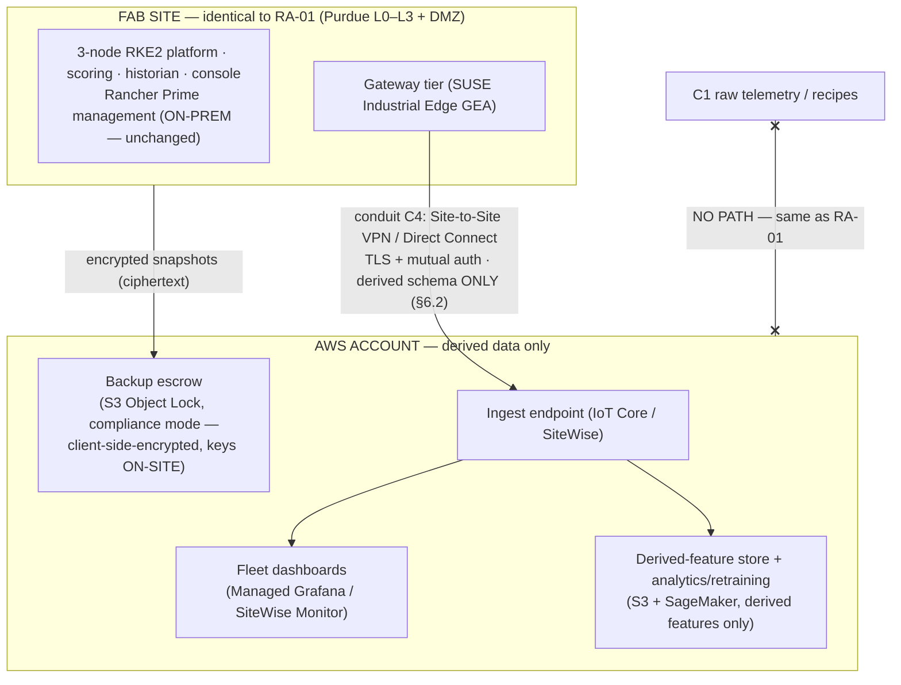

# Reference Architecture RA-02 — Predictive Maintenance at 1,000 Sensor Channels, Hybrid with AWS-Hosted Services

**Audience:** VP of IT/OT and the architecture review board · **Status:** For approval
**Companion document:** [RA-01 — 100% on-premises](RA-01-on-prem.md). Section numbering is identical for side-by-side comparison; sections that are unchanged from RA-01 say so and state only the delta.
**Version basis:** SUSE Edge 3.6.1 release matrix, verified against documentation.suse.com on 2026-07-23 · **Re-verify by:** 2026-10-23

---

## 1. Executive summary

**Decision requested:** approve the same two-phase deployment as RA-01
(pilot → site rollout, §13) **plus** a bounded set of AWS-hosted services
for cross-site visibility, long-horizon analytics, and off-site disaster
recovery — under a closed-list egress contract in which **raw process
telemetry, recipes, and trade-secret data never leave the site**, and the
OT control plane never depends on the cloud.

**What changes vs. RA-01, in one paragraph.** The plant floor is
byte-for-byte the same architecture: the same HA edge platform scores every
channel on-site, and Class-C1 data (raw traces, recipes) still has **no
egress path**. What this variant adds is a second landing zone — an AWS
account under our control — that receives only an enumerated schema of
**derived** fields (§6.2): health scores, RUL forecasts, attribution ranks,
pseudonymized tool IDs. That buys three things RA-01 cannot offer: (1)
fleet-wide dashboards when this pattern extends to additional sites, (2)
long-horizon model analytics and retraining on derived features without
touching site compute, and (3) ransomware-resistant off-site escrow of
client-side-encrypted backups (keys stay on-site — AWS stores ciphertext it
cannot read). The trade is a defined, auditable derived-data flow and a WAN
dependency for those three functions only; **the site runs fully
autonomously when the WAN is down** (§8).

**Situation, complication, and business case** are those of RA-01 §1
(sourced: McKinsey 30–50% downtime reduction; Deloitte +25% productivity /
−70% breakdowns / −25% maintenance cost; Siemens *True Cost of Downtime
2024*; ITIC 2024) — with one addition: as the pattern scales to multiple
sites, per-site on-prem duplication of dashboards/analytics grows linearly,
while this variant centralizes exactly the layer that is safe to
centralize. Choose RA-01 where policy demands zero WAN egress of any kind;
choose RA-02 where fleet visibility and off-site DR justify a
derived-data-only conduit. The documents are otherwise the same platform —
approving RA-02 includes everything in RA-01.

---

## 2. Scope, assumptions, and claim labeling

Identical to RA-01 §2 (labels, A1–A6), plus:

| # | Assumption | Sensitivity |
|---|---|---|
| **A7** | Derived-data egress volume ≤ 1 msg/channel/min summary cadence ⇒ ≤ ~17 msg/s site-wide, trivially within a single VPN tunnel's capacity. | Low |
| **A8** | The data-classification ruling in §6.2 (which fields may cross) is **signed off by site security and legal before Phase 1 exit** — it is a business decision this document records, not an architect's assumption. | Critical |
| **A9** | AWS region [FILL], single account per environment, no cross-region replication of derived data unless DR policy requires it. | Medium |

---

## 3. Requirements

RA-01 §3 applies unchanged, with these NFR additions/overrides:

| NFR | Target | Verification |
|---|---|---|
| Data sovereignty | **Zero egress of C1 data** (unchanged). Derived C2 egress only per the closed schema §6.2, via one governed conduit | Quarterly egress audit now includes VPC flow-log review on the AWS side |
| WAN-loss autonomy | Site scoring, alarming, console, and storage fully operational with WAN down; cloud dashboards go stale and recover by backfill from gateway/broker buffers | Pilot disconnect drill (§13) |
| Cloud tenancy security | AWS account hardened per §7.6 (SCPs, KMS with on-site key escrow for backups, no public endpoints, IAM least privilege) | Third-party cloud config review [FILL: schedule] |

---

## 4. Architecture overview

### 4.1 Zone model — RA-01 §4.1 plus one governed conduit



**The one structural rule of this document:** Rancher Prime management stays
**on-prem** (as in RA-01). AWS never hosts the OT control plane; it hosts
derived-data services and ciphertext escrow — a closed list (§4.5). The
OT loop has zero cloud dependency.

### 4.2–4.4 Tiers, design properties, brownfield

Identical to RA-01 §4.2–4.4. The gateway tier's governed-egress design,
dormant in RA-01, is **active** here: the GEA is the single component
permitted to publish to conduit C4, and only the §6.2 schema
[Lab-verified mechanism: the kit's gateway forwards derived-only fields and
withholds raw structurally; single-node scope].

### 4.5 The AWS closed list (anything not listed is out)

| Service | Function | Data class received |
|---|---|---|
| IoT Core / SiteWise ingest | Terminate conduit C4; validate schema | C2 derived only |
| Managed Grafana or SiteWise Monitor | Cross-site fleet dashboards | C2 |
| S3 (derived store) + SageMaker | Long-horizon analytics; model retraining on derived features; retrained parameters return to site via the DMZ mirror path | C2 |
| S3 Object Lock (compliance mode) | Immutable off-site escrow of **client-side-encrypted** etcd/Longhorn/config backups — WORM that even the root account cannot shorten [Sourced: AWS docs]; decryption keys never leave the site | C3 ciphertext |
| KMS, CloudTrail, SCPs, IAM | Account guardrails and audit | — |

Prior art for this shape exists and is cited rather than reinvented: AWS
*Guidance for Industrial Data Fabric*, *Predictive Maintenance with Amazon
Monitron* [Sourced: AWS Solutions Library]; SiteWise Edge's own documented
pattern is local processing with only approved aggregates sent to the cloud
— with the honest caveat that anything computed at the edge and sent up
**is** in the cloud, which is exactly why §6.2 is a closed, signed schema
[A8].

---

## 5. Component catalog, alternatives, and exit paths

RA-01 §5 applies unchanged on-site. Additional cloud-side rows:

| Function | Selected | Alternative | Exit path |
|---|---|---|---|
| Derived ingest | AWS IoT Core/SiteWise | Self-hosted MQTT bridge on EC2; or RA-01 (no cloud) | MQTT standard; repoint the gateway's egress URL |
| Fleet dashboards | Managed Grafana | Grafana on-prem (RA-01 §5 console covers single-site) | Dashboards are Grafana JSON — portable |
| Analytics/retraining | SageMaker on derived features | On-prem GPU node (RA-01 Tier 3 hardware) | Training code is ours; features are open Parquet |
| Backup escrow | S3 Object Lock | Second on-site failure domain (RA-01 §10.4); any S3-compatible WORM store | Ciphertext blobs — provider-agnostic |
| Site↔cloud conduit | Site-to-Site VPN (Direct Connect at fleet scale) | — | Standard IPsec/BGP |

**Deliberately not selected — AWS Outposts:** it keeps stored data on-prem,
but its service link carries control-plane traffic, updates, and telemetry
to the parent region and the management plane resides in-region [Sourced:
AWS Well-Architected data-residency lens]. That re-introduces a cloud
dependency inside the site boundary that this design exists to avoid;
recorded honestly in §14.

---

## 6. Data governance & sovereignty

### 6.1 Classification — identical to RA-01 §6.1.

### 6.2 Egress matrix and the wire schema (the centerpiece artifact)

RA-01's matrix applies with one added row:

| Flow | Content | Direction | Allowed? |
|---|---|---|---|
| Gateway → AWS ingest (conduit C4) | **Only** the schema below | L3 → AWS | Yes — TLS, mutually authenticated, schema-validated at both ends |

**The complete wire schema (closed; field-level opt-out; anything else is a
violation to be blocked and alerted):**

```json
{
  "site_id": "pseudonymized site token",
  "tool_id": "pseudonymized tool token (mapping table stays on-site)",
  "window_end": "timestamp (see note)",
  "health": "0-100 score",
  "state": "HEALTHY|WATCH|WARNING|CRITICAL",
  "rul_cycles": "integer or null",
  "attribution": ["ranked sensor-role tokens, not raw channel names"],
  "alarm_count_window": "integer"
}
```

Note stated plainly for the review board: even pseudonymized tool IDs plus
timestamps can leak production-schedule intelligence in aggregate. The
pseudonymization mapping lives only on-site; cadence is coarse
(per-minute summaries [A7]); and the schema itself is subject to the signed
classification ruling [A8] with field-level opt-out. This mirrors the
governed-egress contract the reference kit implements and demonstrates
[Lab-verified mechanism: derived-only forwarding with raw structurally
withheld; single-node scope].

### 6.3 Backup escrow crypto contract

Backups are encrypted **on-site** before transfer (site-held keys; envelope
encryption); S3 Object Lock compliance-mode retention makes them immutable
against ransomware and insider deletion [Sourced]. AWS can return the bytes;
it can never read them. Key custody procedure [FILL: site key-management
standard].

---

## 7. Security architecture

RA-01 §7.1–7.5 apply unchanged on-site (defense-in-depth stack, IdP/RBAC,
supply chain, patching, 62443 SL-T 2 mapping). Additions:

### 7.6 Cloud tenancy hardening

Dedicated account per environment; SCP guardrails (deny public S3, deny
regions outside [A9], deny KMS key export); no public endpoints — ingest
reachable only via the VPN/DX conduit; IAM least-privilege with roles, no
long-lived keys; CloudTrail + VPC flow logs shipped to the site SIEM;
quarterly cloud-config review [FILL].

### 7.7 Conduit C4 controls

Mutual TLS with site-issued client certs on the gateway; schema validation
on both ends (gateway refuses to serialize off-schema fields; ingest
rejects and alerts on any); NeuVector/firewall rules restrict the egress
source to the gateway service identity alone — everything else on-site
still has **no** route to the WAN.

---

## 8. Availability & failure modes

RA-01 §8 applies unchanged, plus:

| Failure | Behavior | Recovery | Target |
|---|---|---|---|
| WAN loss (VPN/DX down) | **Site fully autonomous:** scoring, alarms, console, storage unaffected. Cloud dashboards stale; gateways buffer derived summaries (65,000-msg buffer each [Sourced]) and backfill on reconnect | Automatic backfill | No site impact; dashboard staleness = outage duration |
| AWS region/service event | Same as WAN loss from the site's perspective; escrowed backups unaffected (Object Lock) | Await region recovery | No site impact |
| Conduit compromise suspected | Kill the VPN at the site firewall — one rule; site continues as RA-01 | Forensics on flow logs; re-key | Site unaffected by design |

This table is the argument for the structural rule in §4.1: because the OT
loop has no cloud dependency, every cloud failure degrades **visibility**,
never **production**.

---

## 9. Sizing & bill of materials

Site BOM identical to RA-01 §9. Cloud-side: modest managed-service
consumption driven by A7 (~17 msg/s derived ingest, GB-scale monthly derived
store, backup escrow at snapshot cadence) — cloud cost is operational, not
capital, and is quoted at procurement [FILL: AWS pricing at chosen region;
the derived-only volumes keep this in the low hundreds of $/month range,
stated as an assumption-driven estimate, not a quote].

---

## 10. Day-2 operations

RA-01 §10 applies unchanged, plus:

- **10.7 Cloud ops calendar additions:** monthly — SCP/IAM drift review,
  VPN cert expiry check; quarterly — restore-from-escrow drill (prove the
  ciphertext + on-site keys actually restore), egress-schema audit against
  flow logs, cloud cost review.
- **10.8 RACI additions:** cloud account ownership (R: platform eng.,
  A: IT/OT VP, C: site SecOps + cloud CoE [FILL]); escrow key custody
  (R: site SecOps, A: CISO org).

---

## 11. Risk register

RA-01 R1–R7 apply. Additions:

| # | Risk | L×I | Mitigation | Residual | Owner |
|---|---|---|---|---|---|
| R8 | Derived-data schema creep ("just one more field") erodes sovereignty over time | M×H | Closed schema under signed ruling [A8]; change requires the same sign-off; quarterly audit vs. flow logs | Low | Site SecOps |
| R9 | Aggregate derived data leaks schedule intelligence | M×M | Pseudonymization on-site, coarse cadence, field-level opt-out; noted openly in §6.2 rather than discovered later | Medium | Site SecOps |
| R10 | Cloud account misconfiguration exposes C2 data | M×M | §7.6 guardrails; no public endpoints; third-party review | Low | Platform eng. |
| R11 | Organization reads "hybrid" as license to send more later | M×H | This document IS the boundary: the closed list §4.5 + schema §6.2 are the approved envelope; anything beyond returns to the board | Low | IT/OT VP |

---

## 12. Cost model

RA-01 §12 formula and inputs apply. Delta: add cloud operational cost
(assumption-driven estimate §9, quote at procurement) to the annual-cost
line; add the avoided cost of per-site dashboard/analytics duplication to
the benefit line **only when** site #2 is approved [A6] — single-site
economics should justify RA-02 on DR escrow + analytics alone, or RA-01 is
the better choice and this document says so.

---

## 13. Implementation roadmap

RA-01 §13 phases and exit criteria apply, with these additions:

| Phase | Added content | Added exit criteria |
|---|---|---|
| 1 — Pilot | Stand up AWS account + conduit C4 + ingest; escrow pipeline | WAN-disconnect drill: site autonomous, backfill verified, zero loss; schema-violation test: off-schema field rejected AND alerted at both ends; restore-from-escrow drill passes with on-site keys; signed data-classification ruling in hand [A8] |
| 2 — Rollout | Fleet dashboards live; analytics pipeline on derived store | Egress audit clean across one full ops-calendar cycle |

---

## 14. Alternatives considered & exit strategy

RA-01 §14 applies, plus:

| Option | Why not selected |
|---|---|
| **RA-01 (zero egress)** | The honest default. Choose it if fleet visibility and off-site escrow don't justify a derived-data conduit. RA-02 exists for the multi-site trajectory and DR posture — not because cloud is inherently better |
| AWS Outposts | Data residency yes, but control-plane/service-link dependency into the region contradicts the OT-autonomy rule (§4.1); stated per AWS's own data-residency lens, not vendor FUD |
| Cloud-hosted Rancher management (EKS) | Architecturally possible (agents dial out) but makes the OT fleet's management WAN-dependent — rejected; management stays on-site in both documents |
| Azure equivalent of this hybrid | Feasible with IoT Operations/ADX; not selected to keep one cloud landing zone and because the site-side platform is cloud-agnostic either way — the conduit and schema, not the cloud brand, are the architecture |

**Exit from AWS entirely:** kill conduit C4, repoint escrow at any
S3-compatible WORM store, run dashboards on-prem — i.e., become RA-01. That
this sentence is short is the point of the design.

---

## 15. Appendices

### 15.1 Evidence base — identical to RA-01 §15.1, one addition

| Artifact | Proves | Does **not** prove |
|---|---|---|
| Kit gateway governed egress + offline buffer/flush (air-gapped counters, buffer/flush exercised) | The derived-only egress and disconnect-buffering **mechanisms** this document's conduit C4 and WAN-loss rows rely on | Fleet-scale disconnected operation; cloud-side behavior |

### 15.2 Glossary — RA-01 §15.2 plus: Object Lock (S3 WORM immutability) ·
SCP (AWS service control policy) · DX (Direct Connect) · conduit C4 (the
single governed site→cloud flow defined here).

### 15.3 References — RA-01 §15.3 plus: AWS IoT SiteWise Edge documentation
(local processing, aggregate-only egress pattern) · AWS S3 Object Lock
documentation · AWS Well-Architected *Data Residency / Hybrid Cloud
Services Lens* (Outposts service-link nuance) · AWS Solutions Library:
*Guidance for Industrial Data Fabric on AWS*; *Guidance for Predictive
Maintenance with Amazon Monitron*.
